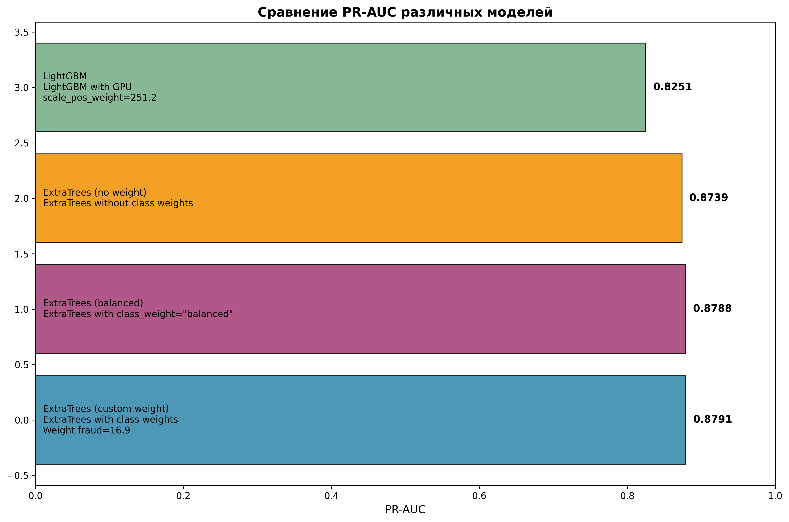
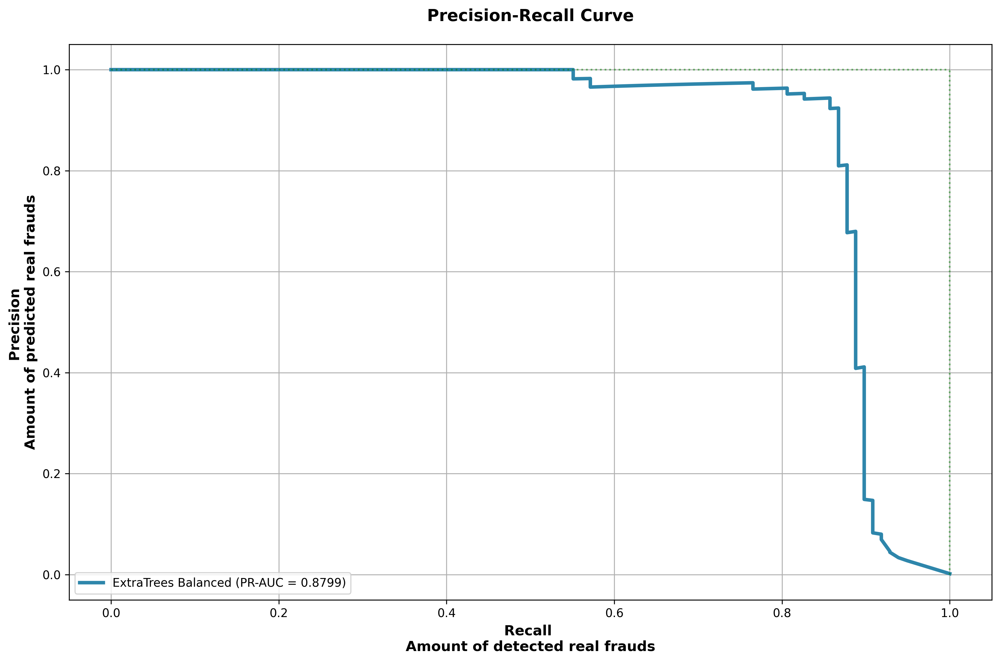

# Fraud Detector
## Project Overview
Detection of fraudulent transactions using machine learning methods. The dataset exhibits severe class imbalance (only 0.172% positive class), making it a challenging real-world problem.

## Dataset
- **Source**: [Credit Card Fraud Detection Dataset from Kaggle](https://www.kaggle.com/datasets/mlg-ulb/creditcardfraud);
- **Size**: 284,807 transactions;
- **Features**: 30 features (28 PCA-transformed features V1-V28, Time, Amount) + Class label;
- **Class Distribution**: 
  - 0 (Legitimate): 284,315 transactions (99.827%);
  - 1 (Fraudulent): 492 transactions (0.173%).

## Data Preprocessing
- **Stratified Sampling**: Used `stratify=y` and `StratifiedKFold` to maintain consistent class distribution across splits;
- **Train/Validation/Test Split**: 80/20 split with consistent class imbalance preservation.

## Model Selection
Three approaches with `ExtraTreesClassifier` were explored:

- `class_weight='balanced`: weights are chosen according to frequency of classes;
- `class_weight=custom` (defined with dict): weights are chosen by user;
- `class_weight=None`: no weight adjustment.

Additional exploration with LightGBM using GPU acceleration.

## Key Results

You can find all results in demonstration notebook `notebooks/exploration.ipynb`.

### PR-AUC Comparison Across Models
[Optuna](https://optuna.org) was used for tuning hyperparameters.



### Best Model PR-AUC Performance


### Key Insights
1. **Custom class weighting outperforms** both balanced and no-weight approaches. However, this outperformance is insignificant;
2. **Feature importance analysis** shows `min_samples_leaf` as the most critical parameter for ExtraTrees;
3. **Simple ensemble methods** outperform more complex gradient boosting for this specific problem.

### Hyperparameter Importance (ExtraTrees)
1. `min_samples_leaf` (57-74% importance across experiments)
2. `max_features` (21-40% importance)
3. `bootstrap` (2-16% importance)
4. Other parameters showed minimal impact (<5%)

## Technical Implementation

### Stack
- **Core**: [numpy](https://numpy.org), [pandas](https://pandas.pydata.org), [scikit-learn](https://scikit-learn.org/stable/index.html);
- **Modeling**: [ExtraTreesClassifier](https://scikit-learn.org/stable/modules/generated/sklearn.tree.ExtraTreeClassifier.html), [LightGBM](https://lightgbm.readthedocs.io/en/stable/) (with GPU support);
- **Optimization**: [optuna](https://optuna.org) for hyperparameter tuning;
- **Visualization**: [matplotlib](https://matplotlib.org), [plotly](https://plotly.com/python/);
- **Serialization**: [joblib](https://joblib.readthedocs.io/en/stable/) for model persistence.

### Optimization Strategy
- **Objective Function**: Maximize PR-AUC with 3-fold cross-validation;
- **Trials**: 200 trials per experiment;
- **Parallelization**: Leveraged `n_jobs=-1` for efficient computation;
- **Visualization**: Optimization history and parameter importance plots. You can find all plots with optuna's hyperparameter importances and optimization history for ExtraTrees and LightGBM in `/results/optuna/*` in two versions: interactive `.html` and simple `.png`.

## How to Reproduce

1. **Dataset**:
Download dataset [here](https://www.kaggle.com/datasets/mlg-ulb/creditcardfraud) and put in into `/data` folder.

2. **Setup Environment**:
```bash
pip install numpy pandas scikit-learn lightgbm optuna matplotlib plotly joblib
```

3. **Run Analysis**:
```bash
jupyter notebook notebooks/exploration.ipynb
```

4. **Load Pretrained Models**:
```python
import joblib
model = joblib.load("models/et/model_et_custom.pkl")
```

## Conclusion
The project successfully demonstrates that carefully tuned ensemble methods can effectively detect fraudulent transactions in highly imbalanced datasets. The optimal approach uses a custom class weight that is significantly different from the intuitive inverse class frequency, highlighting the importance of systematic hyperparameter optimization.

## License
This project is intended for educational purposes. Dataset usage should comply with Kaggle's terms of service.
